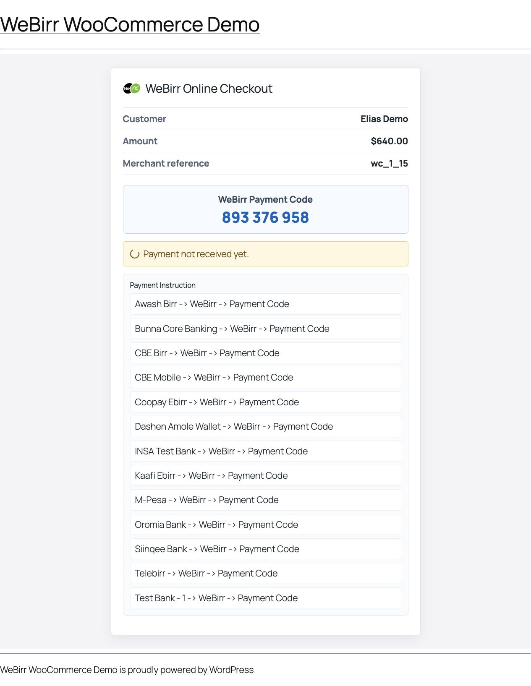
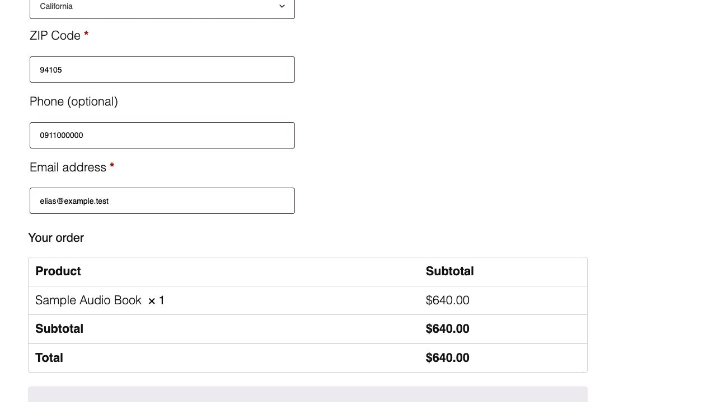

# WeBirr Gateway for WooCommerce



This repository contains the WeBirr payment gateway plugin for WooCommerce plus
a local Docker example that installs and exercises the actual plugin.

## Repository Layout

| Area | Path | Status |
| --- | --- | --- |
| Actual WooCommerce plugin | repository root | Production plugin source. This is the code that must be packaged as a WordPress plugin folder named `woocommerce-gateway-webirr`. |
| Docker checkout example | `examples/docker` | Local WordPress/WooCommerce demo environment that mounts this plugin and validates the checkout flow with TestEnv credentials. |
| Standalone checkout demo | `examples/standalone-checkout-demo` | Standalone PHP checkout showcase. It uses the plugin's WeBirr client classes, but it is not the WooCommerce plugin flow. |
| Lightweight tests | `tests` | PHP tests for client URL generation, bill payload handling, payment-code recovery, supported banks, and idempotent completion. |
| Release packaging helper | `scripts/build-zip.sh` | Builds a plugin ZIP with the correct top-level folder. |

## Actual Plugin

The plugin integrates WeBirr with WooCommerce's payment gateway system. It uses
a WordPress-native WeBirr client based on the WordPress HTTP API, so the plugin
does not require Composer packages on the WordPress server.

Features:

- WooCommerce payment method for classic checkout.
- WooCommerce Checkout Blocks registration when the Blocks payment API is
  available.
- Server-side WeBirr bill creation, bill recovery, and payment-code handling.
- Merchant-supported payment instructions from WeBirr's supported-banks API.
- Browser polling through a WordPress REST endpoint, with WeBirr status checks
  performed on the server side.
- Idempotent WooCommerce order completion after WeBirr confirms payment.
- TestEnv and ProdEnv gateway modes.
- Optional WooCommerce debug logging with API key redaction.
- WooCommerce HPOS compatibility declaration.

Requirements:

- WordPress 6.4 or newer
- WooCommerce 8.0 or newer
- PHP 7.4 or newer
- WeBirr merchant ID and API key

Installation from source:

1. Copy this repository folder into
   `wp-content/plugins/woocommerce-gateway-webirr`.
2. Activate **WeBirr Gateway for WooCommerce** in WordPress.
3. Go to **WooCommerce -> Settings -> Payments -> WeBirr**.
4. Enable the gateway and set:
   - Merchant ID
   - API Key
   - Environment: `TestEnv` or `ProdEnv`
   - Optional debug logging
   - Optional paid order status

Merchant API credentials stay in WordPress admin settings. Browser JavaScript
does not call WeBirr merchant APIs directly.

## How the WeBirr Integration Works

This plugin follows the WeBirr **online checkout pattern**. WooCommerce owns
the order, WordPress owns the merchant credentials, and the browser only sees
safe checkout data such as payment code, merchant reference, supported bank
instructions, and final payment confirmation fields.

| Checkout role | WooCommerce or WordPress entry point | Source | WeBirr call |
| --- | --- | --- | --- |
| Start payment after checkout submit | `WC_Gateway_WeBirr::process_payment` | `includes/class-wc-gateway-webirr.php` | Server-side bill creation or recovery through `Order_Service::prepare_payment` |
| Render payment-code page | `/?webirr-pay-order={order_id}&key={order_key}` | `includes/class-payment-page.php` | Reads current order state and merchant-supported banks |
| Poll payment status | `GET /wp-json/webirr/v1/orders/{order_id}/payment-status?key={order_key}` | `includes/class-rest-controller.php` | Server-side WeBirr payment status check |
| Complete paid order | `Order_Service::complete_order_if_paid` | `includes/class-order-service.php` | Stores payment reference, paid-via value, and completes the WooCommerce order once |

The WeBirr client is implemented in `includes/class-client.php`. It currently
uses these gateway calls:

- Create bill: `POST /einvoice/api/bill`
- Update unpaid bill: `PUT /einvoice/api/bill`
- Get bill by merchant reference or payment code: `GET /einvoice/api/bill`
- Get single payment status: `GET /einvoice/api/paymentStatus`
- Get merchant-supported banks and wallets: `GET /einvoice/api/banks`

Each WeBirr API call includes `api_key` and, when configured, `merchant_id` as
query parameters. Bill payloads also set `merchantID` from the configured
merchant ID when it is non-empty.

The plugin keeps checkout state in WooCommerce order metadata so page refreshes,
duplicate clicks, and repeated status checks can be handled without exposing
merchant credentials to the browser.

## WeBirr Payment Flow

At a glance, the payment flow is:

### 1. Invoice Creation / Checkout on Purchase

- The customer places a WooCommerce order and chooses **WeBirr** as the payment
  method.
- WooCommerce creates a pending order.
- The plugin creates or resumes a WeBirr bill/invoice using a stable merchant
  reference such as `wc_1_42_5f2f8d12-7e31-4e4e-a614-4be3b4e06c91`.
- WooCommerce stores the WeBirr payment code and local payment state on the
  order.

### 2. Payment Code Display

- WeBirr returns a **WeBirr Payment Code** for the customer to enter in a
  supported banking or wallet app.
- The payment page displays the code prominently.
- The payment instructions list only banks and wallets returned by WeBirr for
  the configured merchant.
- The customer payment path is:
  `{Banking App} -> WeBirr menu -> Enter Payment Code -> Pay`.

The payment page should not show a broad static banking or wallet list. It
shows only the subset returned by WeBirr for the configured merchant.

### 3. Payment Status Monitoring

- JavaScript polls the WordPress payment-status endpoint.
- WordPress checks WeBirr payment status from the server side.
- If payment has not been received yet, the page keeps waiting and the customer
  can refresh status safely.

### 4. Completion and Order Access

- Once WeBirr reports the payment as paid, WooCommerce stores the payment
  reference and paid-via value.
- The plugin completes the WooCommerce order exactly once.
- WooCommerce then continues its normal order fulfillment, download access, or
  customer notification flow.

### Detailed Flow

1. A customer starts checkout for a WooCommerce cart.
2. WooCommerce resolves the order amount, customer, billing phone, and store
   context.
3. The customer chooses **WeBirr** and places the order.
4. The plugin creates or resumes the WeBirr bill using the stable merchant
   reference stored on the order.
5. WeBirr returns a **WeBirr Payment Code**.
6. The plugin redirects the customer to the WeBirr payment-code page.
7. The customer opens a mobile banking or wallet app integrated with WeBirr.
8. The customer follows the general app path:
   `{Banking App} -> WeBirr menu -> Enter Payment Code -> Pay`.
9. The browser polls WordPress. WordPress checks WeBirr payment status from the
   server side.
10. When WeBirr reports paid, WooCommerce records the payment reference, records
    `Paid Via`, completes the order, and redirects to WooCommerce's normal order
    received page.

The customer never enters WordPress, WooCommerce, merchant ID, or API key
credentials in the banking app. The WeBirr Payment Code connects the
WooCommerce order to the payment made from the customer's chosen banking or
wallet app. Detailed customer payment instructions are available on the WeBirr
[How to Pay](https://webirr.com/instructions/all.html) page.

## Screenshots

The Docker example screenshots show the plugin running inside WooCommerce with
TestEnv credentials.




## Local Docker Example

### WooCommerce Checkout Example

The Docker example starts WordPress, installs WooCommerce, mounts this plugin,
creates a demo product, and configures WeBirr from environment variables.

```bash
cd examples/docker
cp .env.example .env
# Fill WEBIRR_TEST_ENV_MERCHANT_ID and WEBIRR_TEST_ENV_API_KEY in .env
docker compose up -d
docker compose run --rm cli sh /scripts/bootstrap.sh
```

Open `http://localhost:8097` and test a checkout with the demo product. If that
port is busy, set `WEBIRR_WOOCOMMERCE_PORT` to another local port.

The Docker example switches WooCommerce's generated cart and checkout pages to
classic shortcodes so the screenshot flow validates the classic WooCommerce
payment flow. The plugin also registers WeBirr for WooCommerce Checkout Blocks
when the Blocks payment API is available.

### Standalone Checkout Demo

`examples/standalone-checkout-demo` is a standalone PHP demo app. It shares the
actual plugin client classes in `includes/`, but it has its own HTML,
JavaScript, demo API routes, and SQLite demo storage.

Run it with Docker:

```bash
cd examples/standalone-checkout-demo
cp .env.example .env
# Fill WEBIRR_TEST_ENV_MERCHANT_ID and WEBIRR_TEST_ENV_API_KEY in .env
docker compose up --build
```

Or run it directly from the repository root:

```bash
WEBIRR_TEST_ENV_MERCHANT_ID=your-test-merchant-id \
WEBIRR_TEST_ENV_API_KEY=your-test-api-key \
php -S 127.0.0.1:8095 examples/standalone-checkout-demo/index.php
```

Then open `http://127.0.0.1:8095/`.

Use this standalone demo for quick visual and API checks of the online checkout
pattern. Use the WooCommerce Docker example for release validation of the real
WooCommerce plugin flow.

## Development Checks

```bash
find . -path './dist' -prune -o -name '*.php' -print0 | xargs -0 -n1 php -l
php tests/run.php
```

## Packaging

Build a plugin ZIP whose top-level folder is `woocommerce-gateway-webirr`:

```bash
./scripts/build-zip.sh
```

The ZIP is created under `dist/`.

## Release Status

This plugin is a private release candidate. Before public WordPress.org Plugin
Directory or Woo Marketplace submission, validate the generated ZIP on a staging
WooCommerce site, review marketplace requirements, confirm screenshots and
assets, and complete a TestEnv checkout with debugging enabled.
