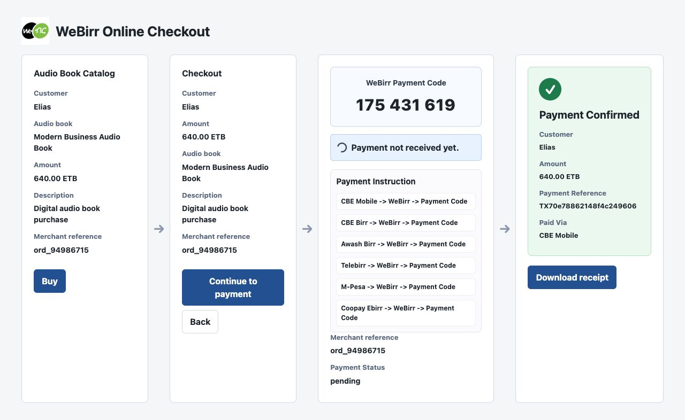
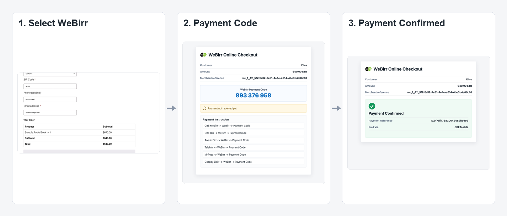
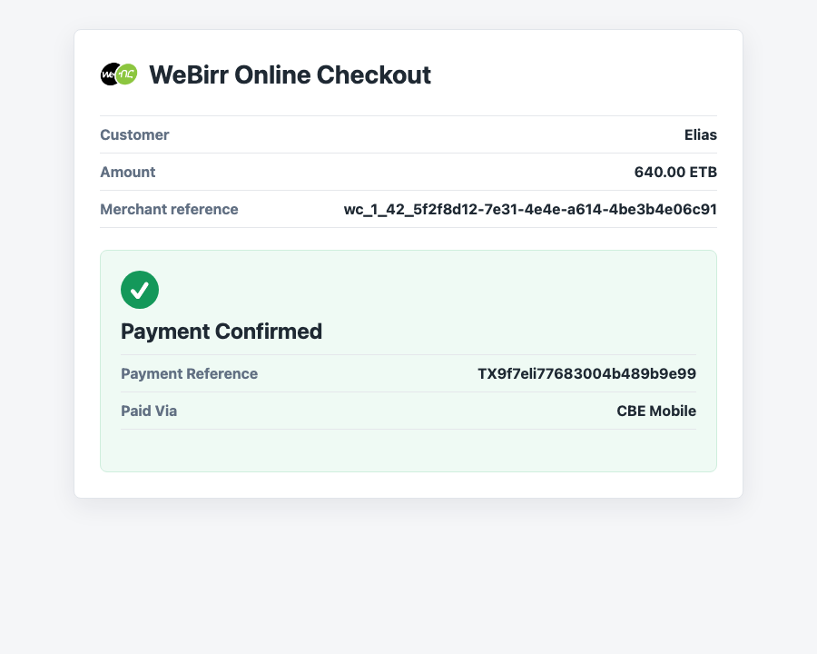

# WeBirr WooCommerce Docker Example



This example starts a local WordPress/WooCommerce store with the WeBirr gateway
mounted from this repository. It is intended for local validation, screenshots,
and release checks before packaging the plugin.

The opener shows the shared WeBirr catalog-first checkout story used across the
checkout examples: catalog selection, checkout review, WeBirr Payment Code
display, and payment confirmation. The screenshots below show the actual
WooCommerce plugin running inside WordPress and WooCommerce.

## What This Example Demonstrates

- WordPress and WooCommerce running in Docker.
- The actual WeBirr WooCommerce plugin mounted into
  `wp-content/plugins/woocommerce-gateway-webirr`.
- WooCommerce configured with a 10-item audio book catalog and classic checkout
  pages.
- TestEnv merchant credentials read from local environment variables.
- WeBirr selected as the payment method during checkout.
- A real WeBirr Payment Code page with merchant-supported payment instructions.
- Browser polling through the plugin's WordPress REST endpoint.
- Paid confirmation with payment reference and paid-via value after server-side
  WeBirr verification.

The example does not write merchant credentials into tracked files.

## Run

```bash
cp .env.example .env
# Fill WEBIRR_TEST_ENV_MERCHANT_ID and WEBIRR_TEST_ENV_API_KEY in .env
docker compose up -d
docker compose run --rm cli sh /scripts/bootstrap.sh
```

Open the demo product URL printed by the bootstrap script, add an audio book to
cart, and choose **WeBirr** at checkout. The script also creates additional
audio book products so the store looks like a small catalog.

Default site URL:

```text
http://localhost:8097
```

If that port is busy, set `WEBIRR_WOOCOMMERCE_PORT` in `.env` and run the
bootstrap command again.

## Example Payment Flow

1. Open the demo WooCommerce product.
2. Add it to the cart.
3. Go to checkout and choose **WeBirr**.
4. Place the order.
5. The plugin creates or resumes the WeBirr bill using the WooCommerce order's
   stable merchant reference.
6. The payment page displays the **WeBirr Payment Code** and the merchant's
   supported banking or wallet instructions.
7. The customer pays in a supported app using:
   `{Banking App} -> WeBirr menu -> Enter Payment Code -> Pay`.
8. The page polls WordPress for payment status.
9. WordPress checks WeBirr from the server side.
10. When paid, WooCommerce stores the payment reference and paid-via value, then
    completes the order.

The browser status request uses the WooCommerce order key from the payment page
URL. The browser never receives the WeBirr merchant ID or API key.

## Screenshots



### Checkout Payment Method

The customer chooses WeBirr during WooCommerce checkout.


### Payment Code Page

After checkout, the customer sees the WeBirr Payment Code and only the payment
instructions returned for the configured merchant.


### Payment Confirmation

After WeBirr reports the payment as paid, the plugin shows the payment reference
and the channel used to pay before WooCommerce continues to the normal order
received page.



## Classic Checkout and Blocks

The bootstrap script configures WooCommerce's generated cart and checkout pages
to use classic shortcodes. This keeps the example screenshot flow stable and
easy to compare during release checks.

The plugin also registers WeBirr for WooCommerce Checkout Blocks when the
Blocks payment API is available. Blocks support should be verified separately in
a WordPress admin page using the block-based checkout template.

## Useful Commands

Show container status:

```bash
docker compose ps
```

Tail WordPress logs:

```bash
docker compose logs -f wordpress
```

Reset the example completely:

```bash
docker compose down -v
```

## Notes

- The production plugin supports only `TestEnv` and `ProdEnv`.
- Mocking belongs in tests or standalone examples, not in production plugin
  settings.
- Payment instructions are loaded from WeBirr's merchant-supported banks
  endpoint.
- Browser JavaScript calls only WordPress. WeBirr merchant APIs are called from
  the WordPress server.
