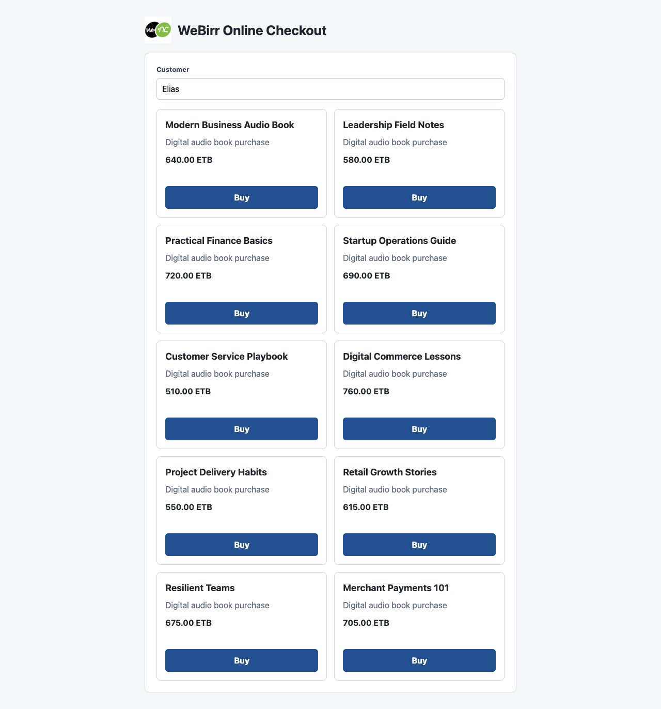
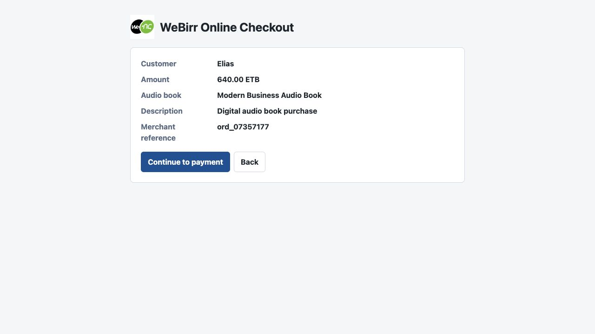
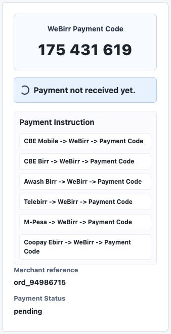
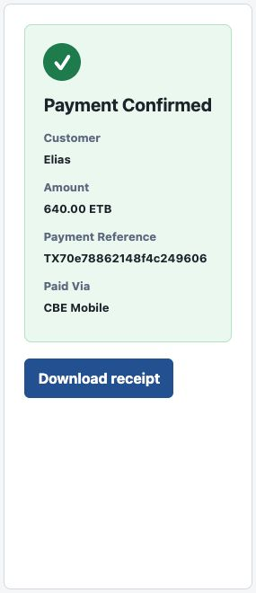

# Standalone Checkout Demo

This standalone PHP demo shows the WeBirr online checkout pattern without
installing WordPress or WooCommerce.


The demo shares the actual WooCommerce plugin's WeBirr client classes:

```text
../../includes/class-client.php
../../includes/class-response-normalizer.php
../../includes/class-supported-banks.php
```

It does not use WooCommerce orders, WordPress REST routes, WordPress admin
settings, or WooCommerce Blocks. It has its own lightweight routes and SQLite
demo storage so the checkout pattern can be shown quickly from a local PHP
server.

## Run With Docker

Copy the environment template and set WeBirr TestEnv credentials:

```sh
cp .env.example .env
```

Edit `.env` and set:

```text
WEBIRR_TEST_ENV_MERCHANT_ID=your-test-merchant-id
WEBIRR_TEST_ENV_API_KEY=your-test-api-key
```

Start the demo from this directory:

```sh
docker compose up --build
```

Open `http://127.0.0.1:8095/`, or use the `STANDALONE_PORT` value from `.env`
if you changed it.

## Run Without Docker

Set TestEnv credentials and start the local PHP server:

```sh
WEBIRR_TEST_ENV_MERCHANT_ID=your-test-merchant-id \
WEBIRR_TEST_ENV_API_KEY=your-test-api-key \
php -S 127.0.0.1:8095 examples/standalone-checkout-demo/index.php
```

Open `http://127.0.0.1:8095/`.

## Checkout Flow

### 1. Audio Book Catalog

The first screen shows 10 audio books and a customer name field defaulting to
`Elias`. Customer name cannot be empty. The browser sends only the selected book
ID and customer name; the server resolves amount and description from the demo
catalog.



### 2. Checkout Review

The next screen shows the checkout summary before creating the WeBirr bill and
payment code. The customer can continue with checkout, go back, or cancel.



### 3. Payment Code Display

When checkout starts, the server creates or resumes the WeBirr bill and displays
the **WeBirr Payment Code**. The browser does not call WeBirr directly; it calls
the local demo server, and the local server calls WeBirr.



### 4. Payment Confirmation

After payment is received, the screen changes to the confirmation view and shows
the payment reference and the channel used to pay.
The customer can then download a `.txt` digital audio book purchase receipt.



## How It Compares To The Plugin

The standalone demo shares the same WeBirr client, response normalizer, and
supported-bank formatter used by the WooCommerce plugin. It does not use
WooCommerce orders or WordPress REST routes, so use it only for quick visual
checks and retry/recovery experiments.

The real WooCommerce plugin remains the release-validation path because it uses
WooCommerce order metadata, the WooCommerce order key, the plugin payment page,
and WooCommerce's native order completion flow.

## How the Customer Pays

The customer uses the displayed **WeBirr Payment Code** inside a mobile banking
or wallet app integrated with WeBirr.

The general customer path is:

```text
{Banking App} -> WeBirr -> Payment Code -> Pay
```

The demo should not show a broad static banking or wallet list. It displays
only the subset returned by WeBirr for the configured merchant.

After the customer pays, the demo checks WeBirr payment status from the server
side and updates the checkout screen from pending to confirmed.

## What This Demo Is For

Use this demo for quick visual and API checks of the online checkout pattern.
Use the Docker WooCommerce example for release validation of the real
WooCommerce plugin flow.
